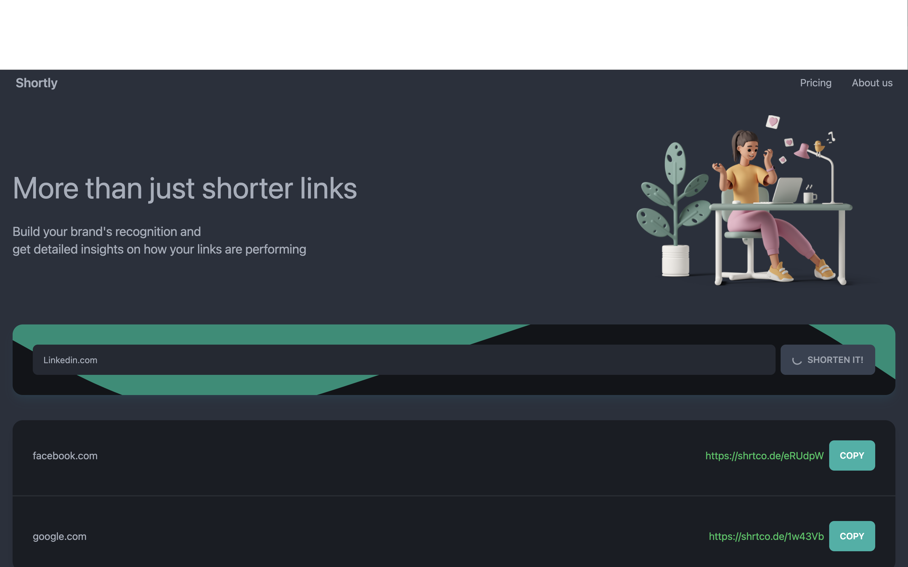
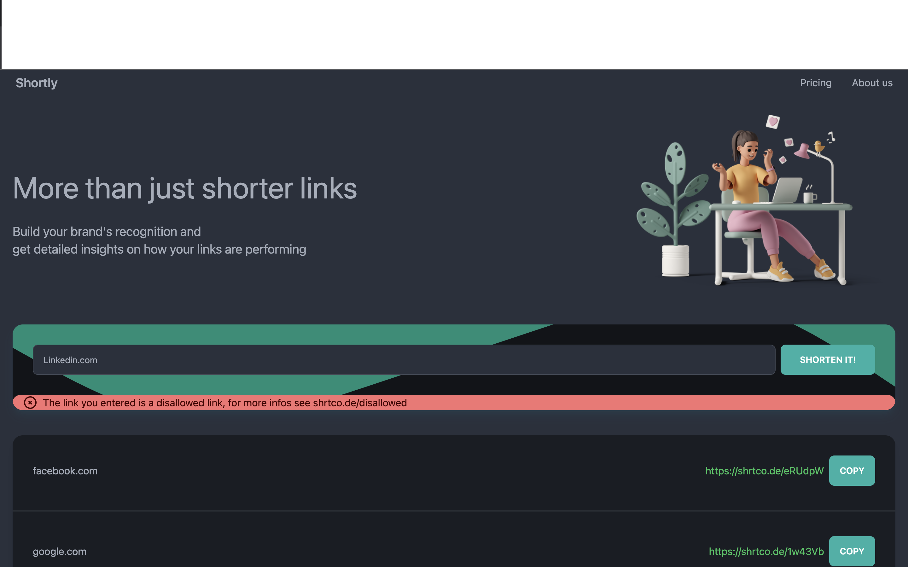
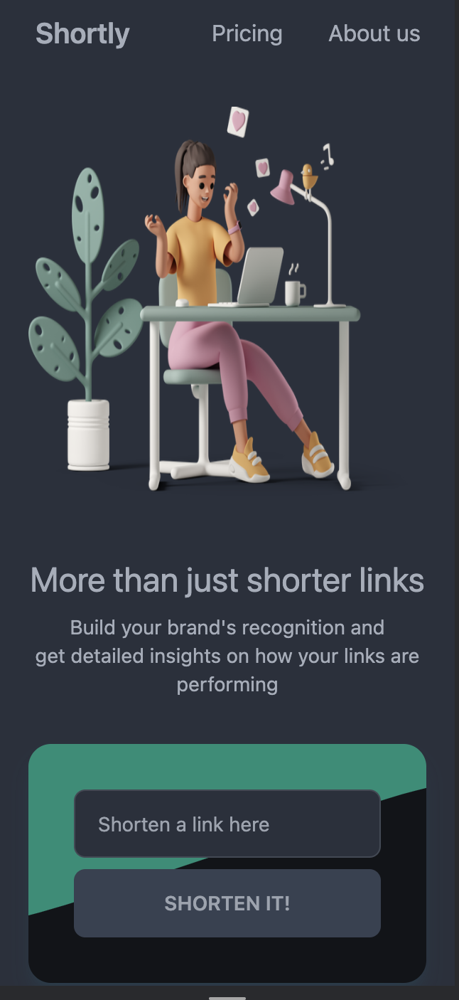

[Deployed URL](https://p-shortly.netlify.app/)

---

Steps to run locally

`npm i`

`npm start`

this will start server at port 3000

`http://localhost:3000/ copy this link and open in browser.`

---

