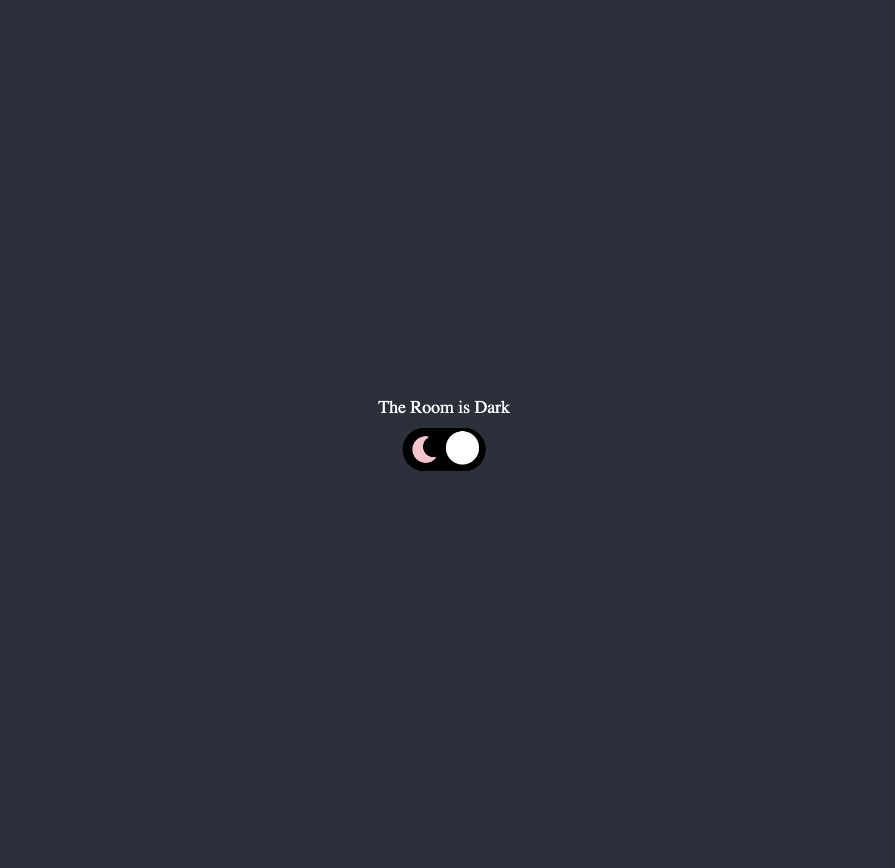
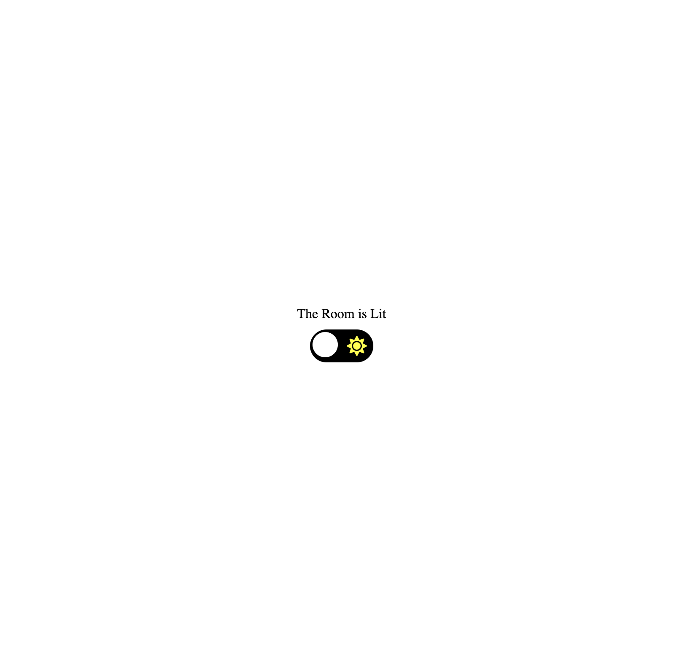

Use the below Codesandbox lin
khttps://codesandbox.io/s/github/dceddia/plain-react-state-lightswitch
It’s a plain React app displaying a “Room” with a light switch. Clicking the button toggles the state, which turns the light on and off.The task is to add Redux to this app, and move the light switch state out of the React component and into Redux.Once you’re done, clicking the button should dispatch an action, and the reducer should return the updated light switch state.
You can leave everything in one file, or split out the Room component into its own file if you like.

---

[Deployed Link](https://p-switch.netlify.app)

---

Steps to run locally

`npm i`

`npm start`

this will start server at port 3000

`http://localhost:3000/ copy this link and open in browser.`

---

